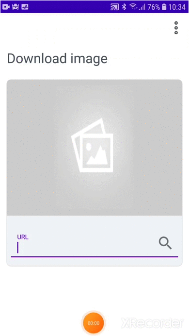

# DownloadImage

Realizar o download das imagens e salvar dentro no aplicativo

## Introduction

Lorem Ipsum is simply dummy text of the printing and typesetting industry. Lorem Ipsum has been the industry's standard dummy text ever since the 1500s, when an unknown printer took a galley of type and scrambled it to make a type specimen book. It has survived not only five centuries, but also the leap into electronic typesetting, remaining essentially unchanged. Lorem Ipsum is simply dummy text of the printing and typesetting industry. Lorem Ipsum has been the industry's standard dummy text ever since the 1500s, when an unknown printer took a galley of type and scrambled it to make a type specimen book. It has survived not only five centuries, but also the leap into electronic typesetting, remaining essentially unchanged.

## Screenshots

## Lista de Bibliotecas utilizadas

- [Foundation][0] - Components for core system capabilities, Kotlin extensions and support for
  multidex and automated testing.
  - [AppCompat][1] - Degrade gracefully on older versions of Android.
  - [Android KTX][2] - Write more concise, idiomatic Kotlin code.
  - [Test][4] - An Android testing framework for unit and runtime UI tests.
- [Architecture][5] - A collection of libraries that help you design robust, testable, and
  maintainable apps. Start with classes for managing your UI component lifecycle and handling data
  persistence.
  - [Data Binding][6] - Declaratively bind observable data to UI elements.
  - [Lifecycles][7] - Create a UI that automatically responds to lifecycle events.
  - [LiveData][8] - Build data objects that notify views when the underlying database changes.

[0]: https://developer.android.com/jetpack/components
[1]: https://developer.android.com/topic/libraries/support-library/packages#v7-appcompat
[2]: https://developer.android.com/kotlin/ktx
[4]: https://developer.android.com/training/testing/
[5]: https://developer.android.com/topic/libraries/architecture/room
[6]: https://developer.android.com/topic/libraries/architecture/viewmodel
[7]: https://developer.android.com/topic/libraries/architecture/workmanager
[8]: https://developer.android.com/topic/libraries/architecture/workmanager
